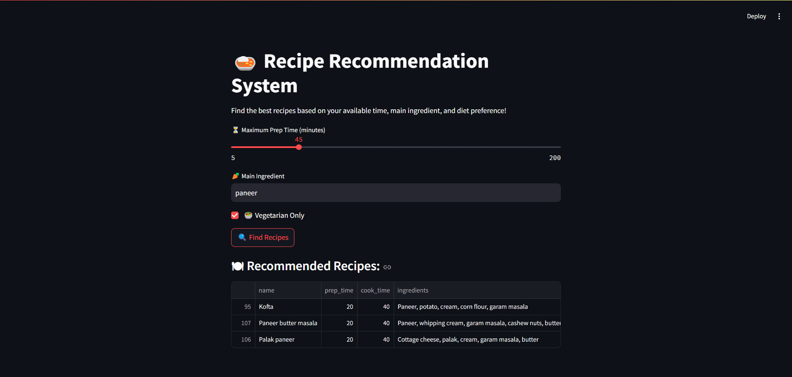

# 🍛 FlavourFind: Intelligent Indian Recipe Recommender

FlavourFind is an intelligent Streamlit-based web application that recommends Indian recipes based on user preferences such as preparation time, main ingredient, and diet (vegetarian/non-vegetarian). Built using a combination of NLP and machine learning techniques, it helps users find quick, relevant, and tasty recipes with ease.

---

## 🚀 Features

- ✅ Personalized recipe suggestions based on:
  - Main ingredient (e.g., "Paneer", "Potato")
  - Prep time (in minutes)
  - Dietary preference (Vegetarian or Non-Vegetarian)
- 🧠 Machine Learning-based recommendation using:
  - TF-IDF for ingredient understanding
  - One-Hot Encoding for categorical features
  - PCA for dimensionality reduction
  - K-Nearest Neighbors for similarity-based suggestions
- 📊 Interactive user interface built with Streamlit
- 🥘 Dataset: IndianFood101 (over 250 traditional Indian recipes)

---

## 📂 Dataset

Dataset used: `indian_food.csv`  
Source: IndianFood101 Dataset (Kaggle)

The dataset contains information on Indian recipes, including:
- Name, Ingredients, Course, Diet, Prep Time, Cook Time
- Region & State (dropped in preprocessing)

---

## 🛠️ Tech Stack

| Tool/Library       | Purpose                          |
|--------------------|----------------------------------|
| Python             | Core Programming Language        |
| Pandas & NumPy     | Data Manipulation                |
| Scikit-learn       | ML Modeling (TF-IDF, PCA, KNN)   |
| Streamlit          | Web App Interface                |
| Regular Expressions| Ingredient Matching              |

---

## 🧪 Methodology

### 1. Data Cleaning & Feature Engineering
- Missing or invalid values (-1) in prep/cook time were replaced with the column mean.
- Total time = prep_time + cook_time
- Dropped region and state columns.

### 2. Encoding & Vectorization
- **One-Hot Encoding**: For categorical features like `diet` and `course`.
- **TF-IDF Vectorization**: To extract meaningful patterns from the ingredient text.

### 3. Dimensionality Reduction
- Applied **PCA** to retain 95% variance and reduce feature dimensions for efficient similarity matching.

### 4. Recipe Matching with KNN
- Trained a K-Nearest Neighbors model to recommend the 3 most similar recipes based on the filtered query.

---

## 🖥️ Usage

### 🔧 Installation

1. Clone the repo:
```bash
git clone https://github.com/yourusername/flavourfind.git
cd flavourfind
````

2. Install dependencies:

```bash
pip install -r requirements.txt
```

3. Run the app:

```bash
streamlit run app.py
```

---

## 🧑‍🍳 How It Works

1. **User Inputs**:

   * Total prep time (slider)
   * Main ingredient (text)
   * Vegetarian or not (checkbox)

2. **Filtering**:

   * Recipes are filtered using regex to match the main ingredient.
   * Further filtered by prep time and diet preference.

3. **Recommendation**:

   * Nearest Neighbors are computed in the PCA-transformed space.
   * Top 3 similar recipes are shown.

---

## 🖼️ Sample Output



---

## 📌 Future Enhancements

* Add filter for spice level or flavor profile
* Include image previews of the dishes
* Enable multiple ingredient selection
* Deploy on cloud (Streamlit Community Cloud or Heroku)

---

## 🤝 Contributions

If you’d like to contribute to making FlavourFind better, feel free to fork the repo and submit a PR.

---

## 📜 License

This project is licensed under the MIT License.

---

## ✨ Acknowledgements

* Indian Food 101 Dataset by Kavya Srivatsa (Kaggle)
* Streamlit for effortless UI
* Scikit-learn for robust ML tools

---

## 💬 Contact

Created with ❤️ by Sharanya Krishnamurthi
📧 [krishnamurthisharanya@gmail.com](krishnamurthisharanya@gmail.com)
🔗 [LinkedIn](www.linkedin.com/in/sharanya-krishnamurthi)

```

